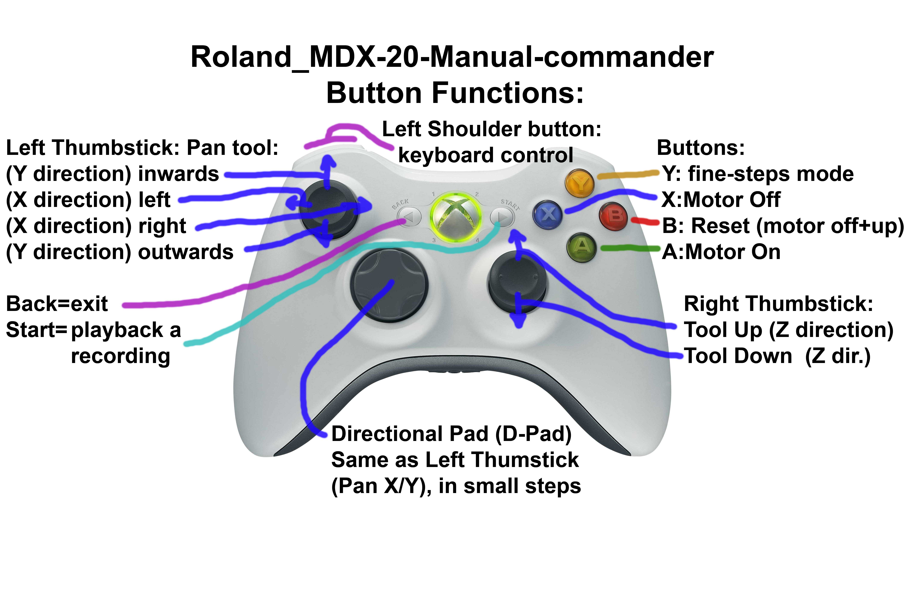

# Roland_MDX-20-Manual-commander
Joystick manual control software for a Roland MDX-20 milling machine

This software that lets you control your RML-1 compatible milling machine (e.g. Roland ModelA MDX-20, MDX-15, etc) with a regular windows joystick.

If you use a wireless USB XBox controller for the joystick, it makes for a *very* cool way to use your milling machine manually :-)

Here are the controls:-

 (Roland_MDX-20-Manual-commander.jpg)

